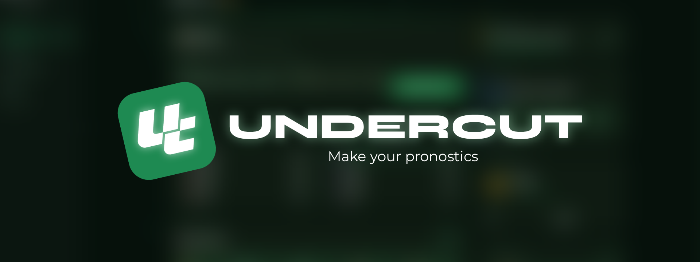
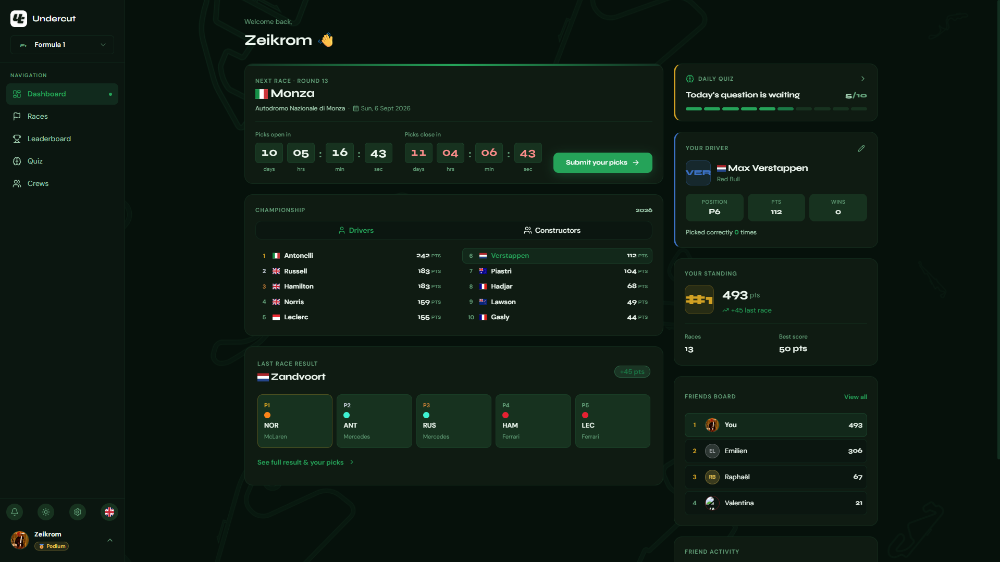
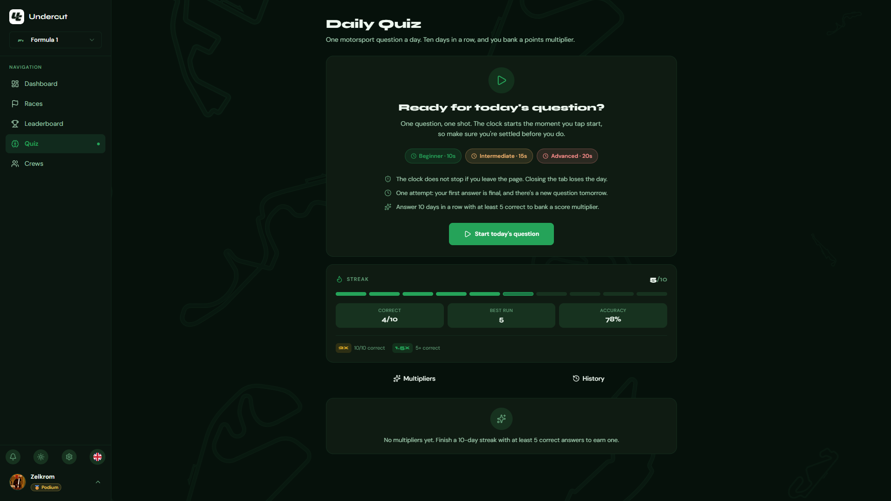
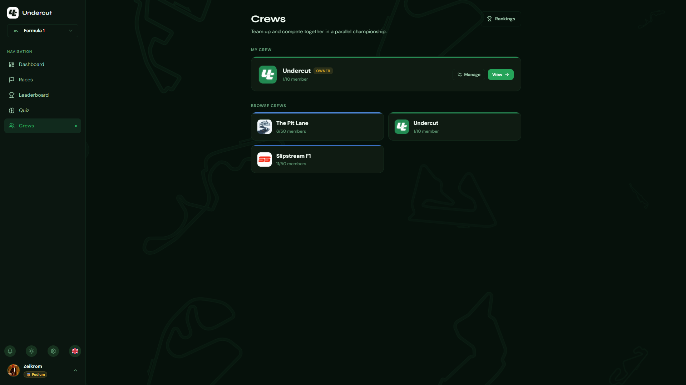
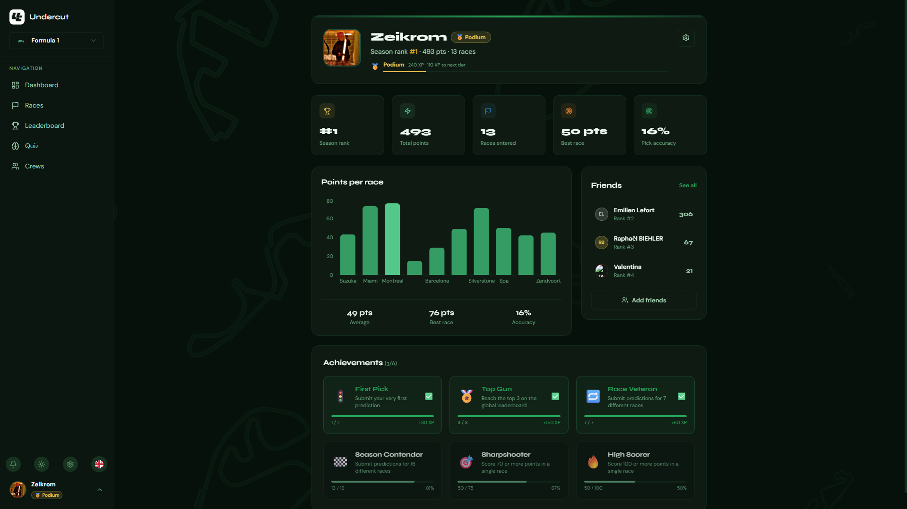

<div align="center">
  
  

  <br>

  <h1>🍃 Undercut</h1>
  <p><strong>The ultimate motorsport predictions app - compete with friends across multiple racing series.</strong></p>
  <a href="https://www.undercut.click">
    
  </a>
</div>

---

## 📖 Overview

**Undercut** is a full-stack web application built for motorsport fans who want to make race predictions more competitive and social.

Before each event, submit your predictions across multiple racing series: Formula 1, Formula 2, Formula E, MotoGP, IndyCar, and more. Choose your favorite motorsports and compete on predictions like fastest lap, race winner, first retirement, and other series-specific events. Points are calculated automatically after each race, and you compete with your friends on seasonal leaderboards.

Inspired by a Discord bot previously used by a community of **30,000+ users**, Undercut brings that experience to a proper web platform with support for the entire world of motorsport.

---

## ✨ Features

- 🏁 **Multi-Series Predictions** - Submit your picks for multiple motorsport series and events
- ⚡ **Automatic Scoring** - Points are calculated automatically based on real race results
- 👥 **Friend System** - Add friends and compete in private leaderboards
- 🏆 **Seasonal Rankings** - Track standings across entire seasons or specific series
- 📅 **Racing Calendar Integration** - Always in sync with official race schedules across all supported series
- 🏎️ **Multiple Motorsports** - Support for Formula 1, Formula 2, Formula E, MotoGP, IndyCar, and more
- 🔐 **Authentication** - Secure login and user account management

---

## 🖼️ Screenshots

<div align="center">
  
  
  
  
</div>

---

## 🛠️ Tech Stack

### Frontend

| Tech         | Role          |
| ------------ | ------------- |
| React        | UI framework  |
| TypeScript   | Type safety   |
| Tailwind CSS | Styling       |
| SCSS         | Custom styles |

### Backend

| Tech       | Role               |
| ---------- | ------------------ |
| NestJS     | REST API framework |
| Prisma     | ORM                |
| MySQL      | Database           |
| BetterAuth | Authentication     |

### Infrastructure & Tooling

| Tech           | Role                |
| -------------- | ------------------- |
| Turborepo      | Monorepo management |
| GitHub Actions | CI/CD               |
| Vercel         | Frontend deployment |
| Render         | Backend deployment  |

---

## 🏗️ Architecture

```
undercut/
├── apps/
|   ├── bot/             # Discord bot that manages undercut guild
│   ├── client/          # React frontend
│   └── server/          # NestJS backend
├── packages/
|   ├── types/           # Shared types
│   └── utils/           # Shared utils
└── turbo.json           # Turborepo config
```

---

## 🚧 Status

Undercut is currently in **public beta**. The app is live and usable, but you may encounter bugs or incomplete features. Development is ongoing with support for additional motorsport series being added regularly.

Found a bug or have a suggestion? [Open an issue](https://github.com/Zeikrom251/undercut.click/issues) - feedback is always welcome!

---

## 📬 Contact

Built with ❤️ by [Ryan - Zeikrom](https://github.com/Zeikrom251)

- 🌐 [undercut.click](https://www.undercut.click)
- 💬 Discord: [Join the server](https://discord.com/invite/7dm7MYMSSh)
